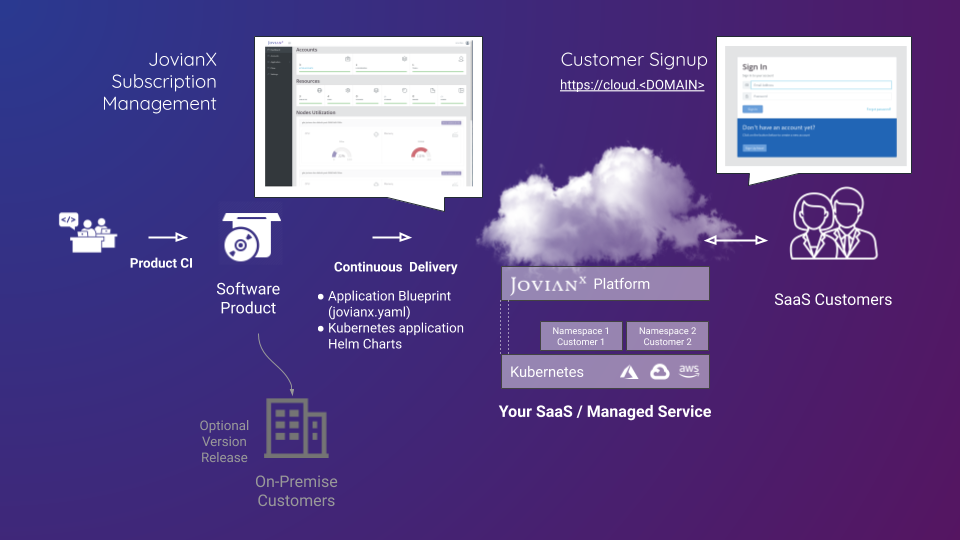
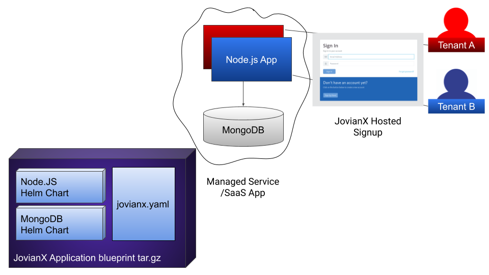

# Hello SaaS World App



# Step 1 - Review applicaiton manifest(Jovianx.yaml)
First, review the application manifest YAML files (a file named [`jovianx.yaml`](https://github.com/jovian-x/hello-world-saas-app/blob/master/jovianx.yaml)). 
The applicaiotn manifest has 2 main sections: the first is `Components` which decalres service components with their properties, and the second is `settings_descriptors` which allows end-users to choose settings and control properties on signup. 

Review the application manifest yaml file: 

```bash
$ cat hello-world-saas-app/jovianx.yaml
```
```yaml
# JovianX API Compatibility
# v1
jovianx_api_version: v1

# Name of this SaaS application
# string
application_name: hello-world-app

# version of this JovianX blueprint
# semantic versioning
version: 1.0.0
...
```

# Step 2 - Create blueprint archive
A JovianX blueprint is a tar.gz archive, it must contain an application manifest file(`jovianx.yaml`) in it's root directory, and also include all the helm chart directories referenced in the application manifest `Jovianx.yaml` file.

Review the files in the blueprint:

```shell
$ tree hello-world-saas-app/

hello-world-saas-app/
├── jovianx.yaml
├── LICENSE
├── mongodb-chart
│   ├── Chart.yaml
│   ├── values.yaml
│   └── ...
├── node-chart
│   ├── Chart.yaml
│   ├── values.yaml
│   └── ...
├── README.md
└── values
    ├── file1
    └── file2
7 directories, 39 files

```

Create a tar.gz archive with the application manifest file(jovianx.yaml) is in the root. 

```sehll
$ cd hello-world-saas-app/
$ tar -czvf blueprint.tar.gz jovianx.yaml node-chart/ mongodb-chart/ values/
```

# Step 3 - Push your blueprint to JovianX 
You can push your application blueprint to JovianX via the UI, or via a dedicated API. You can also integrate push operation with your CI workflow. 

You can push your blueprint via curl:
```bash
$ curl -u '<ACCOUNT_API_KEY>:<ACCOUNT_API_SECRET>' -F 'file=@blueprint.tar.gz' 'https://<YOUR ACCOUNT NAME>.jovianx.app/api/v1/upload_blueprint'
```

> NOTE:
> You can find your ACCOUNT_API_KEY and ACCOUNT_API_SECRET in the blueprints page under `Upload a new Blueprint` card.
>

> NOTE:
> You can also set the blueprint as ACTIVE by adding the querystring `?make_default=true` to the path. 
>


